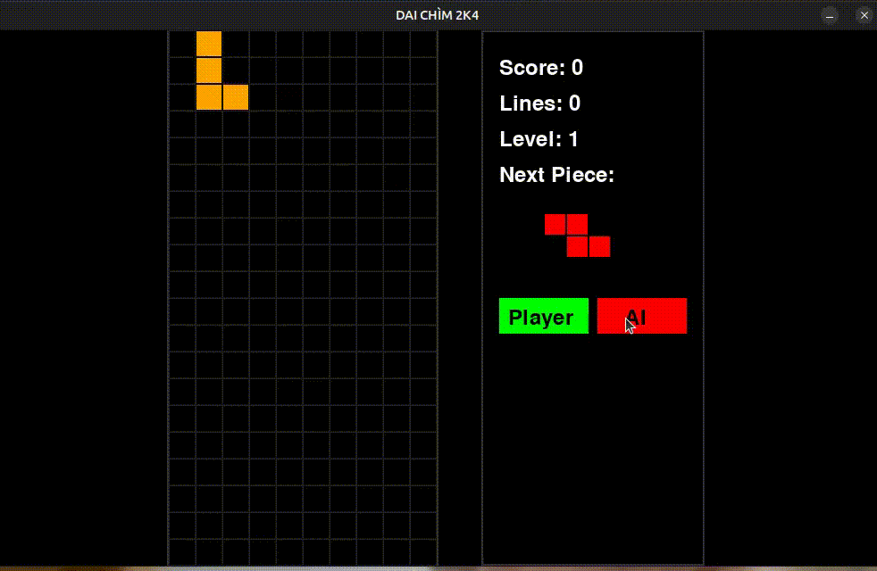

# [PYTORCH] Convolutional Neural Networks for Playing Tetris

## Introduction

Here is my python source code for training a Tetris playing agent. It can be considered as a very basic example of the application of image processing and convolutional neural networks. 


## How to use my code
With my code, you can:
- Get data in [text](< CrawlDataFromYoutube/process_data.ipynb>) and link colab https://colab.research.google.com/drive/1qh5x03UQ5lOYLzSYAtWhDAwC6uHMfCl0#scrollTo=qzLB4Ew5Mq_Q and link youtube I get data https://www.youtube.com/@ClassicTetris
- Train your model and processing data in [text](traningModel/preProcessDataAndTraning.ipynb) and link kaggle if you want run it https://www.kaggle.com/code/khngqungb22dccn654/cnn-tetris
- Test your trained model by running `python test.py`

## Data Collection & Training Process

- The training data was collected from YouTube videos of world championship Tetris matches. Frames were extracted from the videos and processed into images for the CNN model.  
- The data collection process was quite complex. The approach is outlined in `process_data.ipynb`, and the preprocessing steps are detailed in `preProcessDataAndTraning.ipynb`.  
- After preprocessing, nearly **one million images** were available for training.  
- After training for approximately **1000 epochs**, the model achieved a decent level of performance, clearing **30 to 80 lines** per game.  
- Currently, I am optimizing the model with a goal of **200 complete lines**, but achieving this remains a challenge. 😅  

## Requirements

- `matplotlib==3.7.1`
- `numpy==1.24.3`
- `opencv-python==4.8.0`
- `pygame==2.5.0`
- `pytorch==2.0.1`
- `scikit-learn==1.3.0`
- `torch==2.0.1`

## Installation

First, install all dependencies using:

```bash
pip install -r requirements.txt


